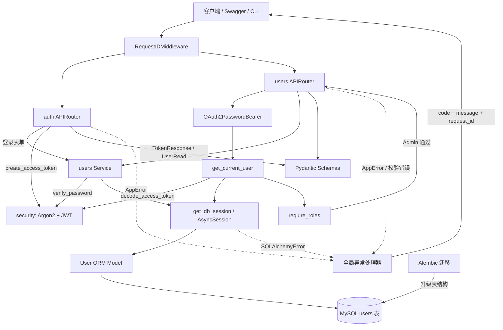

# Phase 1 · Task 4：RBAC 与用户管理 API

## Task 业务目标

认证回答“你是谁”，授权回答“你能做什么”。本 Task 将使用当前用户的数据库角色保护用户管理接口，并完成阶段 1 的错误边界和总验收。

## 四个实现单元

1. `require_roles()` 角色依赖工厂；
2. Admin 创建、列表与读取用户 API；
3. Admin 更新与停用用户 API；
4. 错误边界、完整验收与阶段流程图。

---

# 实现单元 1：`require_roles()` 角色依赖工厂

## 【1】本单元业务目标

为路由生成一个可复用的角色门卫：

```text
Bearer Token
    ↓ get_current_user
当前 User
    ↓ require_roles(Role.ADMIN)
    ├─ role=admin：返回 User，继续执行路由
    └─ 其他角色：抛出 PERMISSION_DENIED（403）
```

## 【2】知识点分层

### 🔴 必须手写掌握

- 编写接收可变数量角色的 `require_roles(*allowed_roles)`；
- 在内部异步函数中判断 `current_user.role`；
- 允许时返回原来的 `current_user`；
- 拒绝时抛出稳定的 403 `AppError`；
- 理解函数返回函数的依赖工厂模式。

### 🟡 理解原理即可

- `*allowed_roles` 在函数内部表现为元组；
- `Callable[[User], Awaitable[User]]` 描述返回函数的类型；
- `Depends(get_current_user)` 保证授权判断发生前已经完成认证；
- 同一个工厂可以生成 Admin-only 或 Admin/Operator 两种门卫。

### 🔵 了解用途

- 单元 2 会把 `require_roles(Role.ADMIN)` 应用到整个 users router；
- 后续商品和报告接口可以声明不同角色组合；
- 动态数据库权限和细粒度资源权限不在阶段 1。

### 开始前只需自行查询的基础知识名称

- Python：闭包、内部函数、`*args`、`in`；
- Python 类型：`Callable`、`Awaitable`；
- FastAPI：依赖链；
- 权限模型：RBAC、认证与授权。

## 【3】项目文件树 + 骨架代码

```text
MarketMind-AI/
├─ backend/app/api/dependencies.py
├─ tests/unit/api/test_roles.py
└─ docs/learning/phase-1-task-4-rbac-users-api.md
```

只填写内部 `check_role()`：

```python
def require_roles(*allowed_roles: Role) -> Callable[[User], Awaitable[User]]:
    async def check_role(
        current_user: Annotated[User, Depends(get_current_user)],
    ) -> User:
        # TODO: 学习者实现
        raise NotImplementedError

    return check_role
```

## 【4】编写顺序 + 如何复用

1. 判断 `current_user.role` 是否不在 `allowed_roles`；
2. 不允许时抛出：

```text
code="PERMISSION_DENIED"
message="权限不足"
status_code=403
```

3. 允许时返回 `current_user`；
4. 删除 TODO 和 `NotImplementedError`。

以后保护 Admin 路由时使用：

```python
Depends(require_roles(Role.ADMIN))
```

允许两个角色时使用：

```python
Depends(require_roles(Role.ADMIN, Role.OPERATOR))
```

## 【5】RED/GREEN 验证 + 完成标准

当前测试应因 `NotImplementedError` 失败：

```powershell
.venv\Scripts\python.exe -m pytest tests\unit\api\test_roles.py -v
```

实现后运行：

```powershell
.venv\Scripts\ruff.exe check backend\app\api\dependencies.py tests\unit\api\test_roles.py
.venv\Scripts\mypy.exe backend\app\api\dependencies.py tests\unit\api\test_roles.py
```

完成标准：4 个角色测试通过；Ruff、mypy 通过；你能解释为什么 `require_roles()` 自己不直接接收当前用户。

完成后回复：

```text
【Task 4 单元 1 编码完成】
```

---

# 实现单元 2：Admin 创建、列表与读取用户 API

## 【1】本单元业务目标

让 Admin 通过 HTTP 复用 Task 2 的用户 Service，同时让非 Admin 在进入路由前被拒绝：

```text
Bearer Token → get_current_user → require_roles(Admin)
    ↓
POST /users          → create_user Service
GET  /users          → list_users Service
GET  /users/{id}     → get_user Service
```

## 【2】知识点分层

### 🔴 必须手写掌握

- 在 Router 级别声明 `Depends(require_roles(Role.ADMIN))`；
- 路由只接收 HTTP 参数并调用对应 Service；
- 为列表声明 `page >= 1`、`1 <= page_size <= 100`；
- 使用 `response_model` 过滤密码哈希；
- 创建成功返回 HTTP 201。

### 🟡 理解原理即可

- Router 级依赖会保护该 Router 下的所有端点；
- FastAPI 把 JSON 转成 `UserCreate`，把查询参数转成整数；
- Service 的 `AppError` 由全局处理器转换为 HTTP；
- API 测试通过 `dependency_overrides` 使用测试库。

### 🔵 了解用途

- OpenAPI 会根据 Schema 自动生成请求和响应说明；
- 后续业务 Router 可以复用相同保护方式。

### 开始前只需自行查询的基础知识名称

- FastAPI：Router 级 Dependencies、Path、Query、状态码；
- HTTP：POST、GET、201；
- Pydantic：请求模型与响应模型。

## 【3】项目文件树 + 骨架代码

```text
backend/app/api/v1/users.py
backend/app/main.py
tests/api/test_users.py::TestAdminUserReads
```

本单元只填写三个 TODO：

```python
async def create_user(...) -> User:
    # TODO: 调用 create_user_service

async def read_users(...) -> UserPage:
    # TODO: 调用 list_users

async def read_user(...) -> User:
    # TODO: 调用 get_user
```

## 【4】编写顺序 + 对应关系

1. `create_user()` 返回 `await create_user_service(session, data)`；
2. `read_users()` 返回 `await list_users(session, page, page_size)`；
3. `read_user()` 返回 `await get_user(session, user_id)`；
4. 删除这三个函数内的 TODO 和 `NotImplementedError`；
5. 不修改单元 3 的 PATCH、DELETE 骨架。

## 【5】RED/GREEN 验证 + 完成标准

```powershell
.venv\Scripts\python.exe -m pytest tests\api\test_users.py::TestAdminUserReads -v
.venv\Scripts\ruff.exe check backend\app\api\v1\users.py tests\api\test_users.py
.venv\Scripts\mypy.exe backend\app\api\v1\users.py tests\api\test_users.py
```

完成标准：5 个测试通过；Admin 可以创建/分页/读取，Analyst 得到 403，无 Token 得到 401。

完成后回复：`【Task 4 单元 2 编码完成】`

---

# 实现单元 3：Admin 更新、重新启用与软停用

## 【1】本单元业务目标

补齐用户生命周期，同时保护两条高风险规则：不能停用自己，不能把自己的 Admin 角色移除。

```text
PATCH /users/{id}  → 查询目标 → 自改角色保护 → update_user
DELETE /users/{id} → 查询目标 → deactivate_user(target, actor)
```

## 【2】知识点分层

### 🔴 必须手写掌握

- 从路径 ID 查询目标用户；
- 把 `UserUpdate` 交给既有 Service 做部分更新；
- 比较 `actor.id` 与目标 ID；
- 仅当提交了不同角色时阻止 Admin 修改自己角色；
- 调用软停用 Service，不能删除数据库记录。

### 🟡 理解原理即可

- `data.role is not None` 表示客户端确实提交了角色；
- `get_current_user` 在同一请求依赖树中会被 FastAPI 缓存；
- PATCH 只改变已提交字段；DELETE 在本项目表达业务停用。

### 🔵 了解用途

- 审计日志和双人审批属于后续生产增强；
- 当前阶段不实现物理删除。

### 开始前只需自行查询的基础知识名称

- Python：复合条件；
- HTTP：PATCH、DELETE；
- REST：软删除；
- 安全：权限降级与自锁风险。

## 【3】项目文件树 + 骨架代码

```text
backend/app/api/v1/users.py
tests/api/test_users.py::TestAdminUserWrites
```

需要填写 `patch_user()` 和 `delete_user()` 两个 TODO。

## 【4】编写顺序 + 规则合同

`patch_user()`：

1. `target = await get_user(session, user_id)`；
2. 若 `actor.id == target.id`，并且 `data.role` 不为 `None` 且不等于 `actor.role`，抛出：

```text
code="USER_SELF_ROLE_CHANGE_FORBIDDEN"
message="不能修改当前用户自己的角色"
status_code=409
```

3. 返回 `await update_user(session, target, data)`。

`delete_user()`：

1. 查询目标；
2. 返回 `await deactivate_user(session, target, actor)`；
3. 自停用规则已经在 Service 中，无需复制。

## 【5】RED/GREEN 验证 + 完成标准

```powershell
.venv\Scripts\python.exe -m pytest tests\api\test_users.py::TestAdminUserWrites -v
.venv\Scripts\ruff.exe check backend\app\api\v1\users.py tests\api\test_users.py
.venv\Scripts\mypy.exe backend\app\api\v1\users.py tests\api\test_users.py
```

完成标准：5 个测试通过；部分更新、重新启用、软停用成功；自停用和自改角色被拒绝。

完成后回复：`【Task 4 单元 3 编码完成】`

---

# 实现单元 4：统一错误边界与 Phase 1 总验收

## 【1】本单元业务目标

让客户端收到稳定、安全、可追踪的错误，而不是框架内部结构、SQL 或连接信息：

```text
请求校验失败 → validation_error_handler → 422 VALIDATION_ERROR
数据库异常   → database_error_handler   → 503 DATABASE_UNAVAILABLE
所有错误响应 → request_id
```

## 【2】知识点分层

### 🔴 必须手写掌握

- 把 `RequestValidationError` 转换成稳定 422 JSON；
- 把 `SQLAlchemyError` 转换成稳定 503 JSON；
- 从 `request.state.request_id` 取得追踪 ID；
- 数据库响应不能包含 `str(exc)`；
- 理解正常业务异常、校验异常和基础设施异常的边界。

### 🟡 理解原理即可

- 全局异常处理器消除每个路由重复的 `try/except`；
- 503 表示服务暂时无法完成请求，不等于客户端输入错误；
- 详细异常应进入服务端日志，但当前 Task 不扩展日志系统。

### 🔵 了解用途

- 生产监控可按错误码和 Request ID 聚合问题；
- 重试策略应由具体客户端和幂等性共同决定。

### 开始前只需自行查询的基础知识名称

- FastAPI：异常处理器、`RequestValidationError`；
- SQLAlchemy：`SQLAlchemyError`；
- HTTP：422、503；
- 可观测性：Request ID。

## 【3】项目文件树 + 骨架代码

```text
backend/app/core/exception_handlers.py
backend/app/main.py
tests/api/test_errors.py
```

需要填写：

```python
async def validation_error_handler(...) -> JSONResponse:
    # TODO

async def database_error_handler(...) -> JSONResponse:
    # TODO
```

## 【4】编写顺序 + 响应合同

校验错误返回：

```python
{
    "code": "VALIDATION_ERROR",
    "message": "请求参数校验失败",
    "request_id": request.state.request_id,
}
```

数据库错误返回：

```python
{
    "code": "DATABASE_UNAVAILABLE",
    "message": "数据库暂时不可用",
    "request_id": request.state.request_id,
}
```

分别使用状态码 422 和 503。不要返回 `exc`、`str(exc)`、SQL 或连接串。完成后删除两个 TODO 和 `raise exc`。

## 【5】RED/GREEN 验证 + 完成标准

```powershell
.venv\Scripts\python.exe -m pytest tests\api\test_errors.py -v
.venv\Scripts\python.exe -m pytest -q
.venv\Scripts\ruff.exe check .
.venv\Scripts\mypy.exe backend tests
git diff --check
```

完成标准：错误测试通过；完整测试、Ruff、mypy 和 diff 检查通过；随后由 Agent 补充 Phase 1 总流程图并执行最终验收。

完成后回复：`【Task 4 单元 4 编码完成】`

---

# Task 4 参考实现与验收

## 单元 1 参考：RBAC 依赖工厂

```python
def require_roles(*allowed_roles: Role) -> Callable[[User], Awaitable[User]]:
    async def check_role(
        current_user: Annotated[User, Depends(get_current_user)],
    ) -> User:
        if current_user.role not in allowed_roles:
            raise AppError(
                code="PERMISSION_DENIED",
                message="权限不足",
                status_code=403,
            )
        return current_user

    return check_role
```

关键点：外层函数保存允许角色，内层函数等待 FastAPI 注入当前用户。一个实现可以生成多种角色规则。

## 单元 2 参考：创建、列表与读取

```python
async def create_user(data: UserCreate, session: AsyncSession) -> User:
    return await create_user_service(session, data)


async def read_users(
    session: AsyncSession, page: int = 1, page_size: int = 20
) -> UserPage:
    return await list_users(session, page, page_size)


async def read_user(user_id: int, session: AsyncSession) -> User:
    return await get_user(session, user_id)
```

实际文件保留 `Annotated[..., Depends(...)]` 和 `Query` 类型声明；上面省略它们是为了突出 Router 与 Service 的一一对应关系。

## 单元 3 参考：更新与软停用

```python
async def patch_user(user_id, data, session, actor) -> User:
    target = await get_user(session, user_id)
    if actor.id == target.id and data.role is not None and data.role != actor.role:
        raise AppError(
            code="USER_SELF_ROLE_CHANGE_FORBIDDEN",
            message="不能修改当前用户自己的角色",
            status_code=409,
        )
    return await update_user(session, target, data)


async def delete_user(user_id, session, actor) -> User:
    target = await get_user(session, user_id)
    return await deactivate_user(session, target, actor)
```

不要写成 `deactivate_user = await deactivate_user(...)`。赋值目标会让函数名变成局部变量，右侧调用就会引用尚未赋值的局部变量。

## 单元 4 参考：错误边界

```python
async def validation_error_handler(request, exc) -> JSONResponse:
    return JSONResponse(
        status_code=422,
        content={
            "code": "VALIDATION_ERROR",
            "message": "请求参数校验失败",
            "request_id": request.state.request_id,
        },
    )


async def database_error_handler(request, exc) -> JSONResponse:
    return JSONResponse(
        status_code=503,
        content={
            "code": "DATABASE_UNAVAILABLE",
            "message": "数据库暂时不可用",
            "request_id": request.state.request_id,
        },
    )
```

数据库处理器故意不读取 `str(exc)`，避免 SQL、账号、主机或连接串进入客户端响应。

---

# Phase 1 类与函数总流程图



## Phase 1 学习结果

你已经亲手实现了四条可迁移能力：

1. `Model → Alembic → MySQL`：数据库结构和迁移；
2. `Schema → Service → AsyncSession`：输入校验与业务事务；
3. `密码 → JWT → 当前用户`：认证链路；
4. `当前用户 → RBAC → 用户 API → 错误边界`：授权与受保护接口。

后续商品、知识库和 Agent 模块仍会复用这四层，不会重新发明数据库会话、认证或角色校验。

## Phase 1 最终人工验收

启动 API：

```powershell
.venv\Scripts\uvicorn.exe app.main:create_app --factory --app-dir backend --host 127.0.0.1 --port 8010
```

打开 `http://127.0.0.1:8010/docs`，依次完成：

1. 使用已有 Admin 邮箱和密码调用 `/api/v1/auth/token`；
2. 点击 Swagger 的 Authorize，填入获得的 Token；
3. 调用 `POST /api/v1/users` 创建一个 Operator；
4. 使用 Operator 登录并访问 `GET /api/v1/users`，确认返回 403；
5. 切回 Admin Token，停用 Operator；
6. 使用被停用 Operator 的旧 Token 调用 `/api/v1/auth/me`，确认返回 403；
7. 确认所有错误响应包含 `code`、`message` 和 `request_id`。

人工运行完成后，用自己的话回答：

1. 为什么 Model 攗了，MySQL 表不会自动改变？
2. 为什么密码哈希不能用于还原明文，而 JWT Payload 却可以被读取？
3. 为什么 Token 签名正确后仍要查询数据库？
4. 401 和 403 分别表示什么？
5. `require_roles()` 为什么设计成“返回内部函数”的函数？
6. 为什么 API 测试必须覆盖 `get_db_session` 并连接 `marketmind_test`？

这六题不是背术语。每题至少结合本项目中的一个具体文件或函数回答。

## Phase 1 文字验收记录

### 1. Model 与数据库迁移

SQLAlchemy Model 只是 Python 中的表结构声明，不会主动修改真实 MySQL 表。修改 `models/user.py` 后，需要生成并检查 Alembic 迁移，再执行升级，数据库结构才会改变。

### 2. 密码哈希与 JWT Payload

密码通过 Argon2 做带盐的单向哈希，只能验证候选密码，不能还原明文。JWT Payload 只是 Base64URL 编码，不是加密，因此不能写入密码或密钥等敏感信息。

### 3. 为什么验证 JWT 后仍查询数据库

签名和过期时间只能证明 Token 由可信服务签发、未被篡改且仍在有效期内。`get_current_user()` 仍需查询数据库，确认用户存在且 `is_active=True`；RBAC 也必须读取数据库中的最新角色。

当前实现没有 Token 版本号、`password_changed_at` 或吊销列表，因此修改密码不会自动使旧 Token 失效。需要该能力时必须增加专门的失效机制，不能假设数据库查询已经实现。

### 4. 401 与 403

- 401：无法确认合法身份，例如缺少、损坏或过期 Token；响应应包含 `WWW-Authenticate: Bearer`。
- 403：身份已经确认，但账号停用或角色不允许执行当前操作。

### 5. `require_roles()` 的准确模式

`require_roles()` 是依赖工厂，同时使用了闭包；它不是装饰器工厂。调用 `require_roles(Role.ADMIN)` 会返回异步依赖 `check_role()`，再由 `Depends(...)` 执行：

```python
Depends(require_roles(Role.ADMIN))
```

它不使用 `@装饰器` 语法，也不接收 `['admin']` 字符串列表，而是接收一个或多个 `Role` 枚举值。

### 6. API 测试为什么覆盖 Session 依赖

生产 `get_db_session()` 提供并在请求结束后关闭 `AsyncSession`。API 测试通过 `app.dependency_overrides` 把它替换为绑定 `marketmind_test` 的测试 Session，防止任何测试请求访问开发库。

提交和业务失败回滚由 Service 负责；测试数据最终清理由 `tests/conftest.py` 的外层事务回滚负责。三者职责不同，不能都归入 `get_db_session()`。

## Phase 1 人工运行验收结果

已完成 Admin 登录、Swagger 授权、创建 Operator、Operator 越权返回 403、停用账号、停用账号旧 Token 返回 403，以及错误响应 `code`、`message`、`request_id` 检查。
